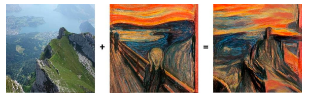

# Brief Introduction
**Computer Vision** là một lĩnh vực khoa học máy tính tập trung vào việc tạo 
ra các hệ thống máy tính có thể hiểu và phân tích hình ảnh và video. Nó có nhiều ứng
dụng trong các lĩnh vực như: Nhận diện đối tượng, xử lý ảnh Y Khoa, Robotic, v.v...

Có rất nhiều thư viện trong Python để chúng ta xử lý dữ liệu ảnh, trong đó OpenCV
là một trong những thư viện điển hình.

# Chuyển đổi không gian màu
OpenCV cung cấp nhiều hàm để chuyển đổi giữa các không gian màu khác nhau.
|  Hàm | Chuyển đổi  | Mô tả  |
|---|---|---|
|  cv2.COLOR_BGR2GRAY | BGR sang ảnh xám  | Chuyển đổi ảnh từ BGR sang ảnh xám.  |
|  cv2.COLOR_BGR2HSV |  BGR sang HSV | Chuyển đổi ảnh từ BGR sang không gian màu HSV (Hue, Saturation, Value).  |
|  cv2.COLOR_BGR2RGB |  BGR sang RGB | Chuyển đổi ảnh từ BGR sang không gian màu RGB (R - Red, G - Green, B - Blue).  |

# Bộ lọc Gauss (Gausian Blur)
* **Bộ lọc Gauss (Gaussian Blur)** là một kỹ thuật xử lý ảnh phổ biến được sử
dụng để làm mịn ảnh và loại bỏ nhiễu. Nó hoạt động bằng cách áp dụng một ma
trận Gauss (Gaussian kernel) lên từng pixel của ảnh.
* **Hàm Gauss** là một hàm phân phối xác suất có dạng hình chuông. Giá trị của
hàm Gauss tại mỗi pixel được xác định bởi độ lệch chuẩn (sigma) của hàm. Sigma
càng lớn, mức độ làm mịn càng cao.Công thức tổng quát của Gaussian Filter như
sau:

$G(x,y) = \displaystyle \frac{1}{2 \pi \delta ^2}\cdot exp\left ( -\frac{x^2 + y^2}{2\delta ^2} \right )$

# Gram matrix
Trong lĩnh vực Style Transfer, Gram Matrix là một công cụ quan trọng để nắm bắt và đại
diện cho phong cách của một hình ảnh. Gram Matrix được tính từ các đặc trưng (feature
maps) của một mạng nơ-ron tích chập (Convolutional Neural Network - CNN).

**Cách tính Gram Matrix**

Giả sử bạn có một tensor F đại diện cho các feature maps của một hình ảnh sau khi đi qua
một lớp tích chập. Tensor này có kích thước (C, H, W), trong đó:
* C là số lượng các kênh (channels).
* H là chiều cao của feature map.
* W là chiều rộng của feature map.
Gram Matrix G có kích thước (C, C) và được tính bằng công thức:

$G_{ij} = \displaystyle \sum_{k}^{}F_{ik}F_{jk}$

trong đó $F_ik$ và $F_jk$ là các phần tử của tensor F tại kênh i và j, với k chạy qua tất cả các vị trí không gian (spatial locations).

**Vai trò của Gram Matrix trong Style Transfer**

Gram Matrix giúp nắm bắt mối quan hệ tương quan giữa các feature maps và đại diện cho
cấu trúc tổng thể của hình ảnh, chẳng hạn như các mẫu và kết cấu, chứ không phải các chi
tiết cục bộ. Trong Style Transfer, Gram Matrix của hình ảnh phong cách được so sánh với
Gram Matrix của hình ảnh kết quả để đảm bảo rằng phong cách của hình ảnh gốc được
chuyển sang hình ảnh mới.