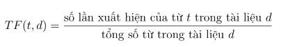
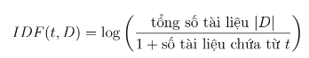
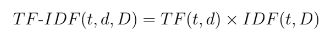

# Term frequency and Invert Document Frequency (Bài toán mã đi tuần)
* **TF-IDF (term frequency–inverse document frequency)** là một kỹ thuật phổ biến trong lĩnh vực xử lý ngôn ngữ tự nhiên và khai thác văn bản. Mục đích của TF-IDF là để đánh giá tầm quan trọng của một từ trong một tài liệu so với toàn bộ tập hợp các tài liệu (corpus).
* **Term Frequency (TF)**: Đo lường tần suất xuất hiện của một từ trong một tài liệu. Công thức tính:

* **Inverse Document Frequency (IDF)**: Đo lường mức độ phổ biến của một từ trong tập hợp các tài liệu. Công thức tính:

Trong đó, |D| là tổng số tài liệu và số tài liệu chứa từ t được cộng thêm 1 để tránh chia cho 0.

* **TF-IDF**: Là tích của TF và IDF, giúp xác định tầm quan trọng của một từ trong một tài liệu cụ thể, đồng thời giảm thiểu ảnh hưởng của các từ phổ biến nhưng ít mang ý nghĩa.

TF-IDF giúp phân biệt các từ quan trọng đối với nội dung của một tài liệu so với các từ xuất hiện thường xuyên trong nhiều tài liệu khác nhau nhưng ít mang giá trị thông tin.

Reference: python_excercise/day21.py

# Transformer
Trong lĩnh vực trí tuệ nhân tạo, Transformer là một kiến trúc mạnh mẽ và hiệu quả trong
việc xử lý ngôn ngữ tự nhiên (NLP). Một trong những yếu tố quan trọng tạo nên sức mạnh
của Transformer là cơ chế Attention.

## Attention là gì?
Attention cho phép mô hình tập trung vào các phần khác nhau của chuỗi đầu vào khi tạo
ra mỗi phần tử của chuỗi đầu ra. Điều này giúp mô hình đánh giá tầm quan trọng của mỗi
từ trong câu và cải thiện khả năng hiểu ngữ cảnh.

## Công thức Attention
Công thức cho cơ chế Attention được biểu diễn như sau:

$Attention(Q,K,V) = softmax\left ( \displaystyle \frac{QK^T}{\sqrt{d_k}} \right )V$ &emsp;&emsp;&emsp;&emsp;&emsp; (1)

Trong đó:
* Q là ma trận query
* K là ma trận key
* V là ma trận value
* dk là kích thước chiều của vector key
* softmax là hàm softmax, được tính toán như sau:

$Hàm\;kích\;hoạt\;Softmax(x_i) = \displaystyle\frac{exp(x_i)}{\sum _j exp(x_j)}$&emsp;&emsp;&emsp;&emsp;&emsp; (2)

## Positional Embedding
Positional embedding là một phương pháp để mã hóa thông tin về vị trí của các từ trong
câu. Transformer không có cấu trúc tuần tự, do đó cần có cách để cung cấp thông tin về vị
trí của từ trong câu cho mô hình.

### Formula
Với một từ tại vị trí pos trong câu và chiều của embedding vector là $d_{model}$, positional embedding được tính như sau:

$PE_{(pos, 2i)} = sin\left ( \displaystyle \frac{pos}{10000^{\frac{2i}{d_{model}}}} \right )$&emsp;&emsp;&emsp;&emsp;&emsp; (3)

$PE_{(pos, 2i+1)} = cos\left ( \displaystyle \frac{pos}{10000^{\frac{2i}{d_{model}}}} \right )$&emsp;&emsp;&emsp;&emsp;&emsp; (4)

Trong đó:
- *pos* là vị trí của từ trong câu (bắt đầu từ 0).
- *i* là chỉ số của chiều trong vector embedding.
- $d_{model}$ là độ dài của vector embedding.

### Explaination:
- Các giá trị $PE_{(pos, 2i)}$ sử dụng hàm sin để mã hóa thông tin vị trí cho các chỉ số chẵn.
- Các giá trị $PE_{(pos, 2i+1)}$ sử dụng hàm cos để mã hóa thông tin vị trí cho các chỉ số lẻ.
- Số mũ của 10000 chia cho $d_{model}$ để điều chỉnh tần số của các giá trị sin và cos sao cho các từ ở các vị trí khác nhau có embedding khác biệt rõ rệt.

### Advantage
- **Tính khả vi**: Hàm sin và cos là các hàm khả vi, giúp cho mô hình có thể học thông qua quá trình lan truyền ngược.
- **Mã hóa tuần tự**: Các giá trị sin và cos cho phép mô hình phân biệt được các vị trí khác nhau của từ trong câu, đảm bảo thông tin về thứ tự từ được duy trì.
- **Khả năng tổng quát hóa**: Các hàm tuần hoàn như sin và cos giúp mô hình tổng quát hóa tốt hơn cho các câu dài hơn hoặc ngắn hơn các câu trong tập huấn luyện.

