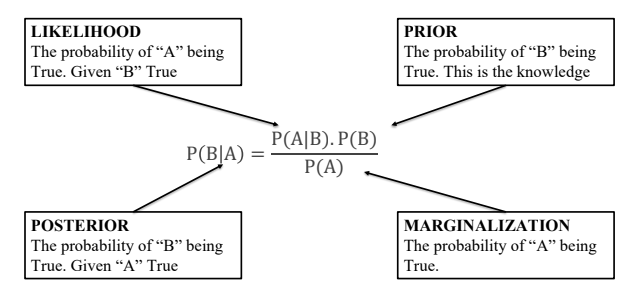

# Correlation (Tương quan)
Correlation là một phép đo thống kê cho biết mức độ và hướng của mối quan hệ giữa hai
biến số. Khi hai biến số có mối quan hệ tương quan, giá trị của một biến có thể ảnh hưởng
đến giá trị của biến còn lại.
* **Positive Correlation (Tương quan dương)**: Khi giá trị của một biến tăng thì giá trị của biến kia cũng tăng.
* **Negative Correlation (Tương quan âm)**: Khi giá trị của một biến tăng thì giá trị của biến kia giảm.
* **No Correlation (Không tương quan)**: Không có mối quan hệ rõ ràng giữa hai biến.

# Correlation Coefficient (Hệ số tương quan)
Hệ số tương quan là một giá trị số từ -1 đến 1 cho biết mức độ của mối quan hệ tương quan:
* 1: Mối quan hệ tương quan hoàn hảo dương.
* 0: Không có mối quan hệ tương quan.
* -1: Mối quan hệ tương quan hoàn hảo âm.

**Công thức tính hệ số tương quan Pearson (Pearson Correlation Coefficient)**

 $r = \displaystyle\frac{\sum (X - \overline{X})(Y - \overline{Y})}{\sqrt{\sum _{}^{}(X - \overline{X})^2 \sum (Y - \overline{Y})^2}}$

Trong đó:
* $X$ và $Y$ là hai biến số
* $\overline{X}$ và $\overline{Y}$ là giá trị trung bình của X và Y

# Confusion Matrix và Các Metric Đánh Giá
Confusion matrix và các metric đánh giá liên quan là những công cụ quan trọng trong học
máy (machine learning) để đánh giá hiệu suất của mô hình phân loại. Dưới đây là mô tả chi
tiết về confusion matrix và các metric đánh giá phổ biến:
## Confusion Matrix
Confusion matrix là một bảng ma trận có kích thước m × m (với m là số lượng lớp) được
sử dụng để mô tả hiệu suất của một mô hình phân loại. Mỗi hàng của ma trận đại diện cho
các mẫu thuộc lớp thật (actual class), trong khi mỗi cột đại diện cho các mẫu được mô hình
dự đoán (predicted class).

Một confusion matrix cơ bản cho bài toán phân loại nhị phân (2 lớp) bao gồm 4 thành phần chính:
* **True Positives (TP)**: Số lượng mẫu mà mô hình dự đoán đúng là dương.
* **True Negatives (TN)**: Số lượng mẫu mà mô hình dự đoán đúng là âm.
* **False Positives (FP)**: Số lượng mẫu mà mô hình dự đoán là dương nhưng thực tế là
âm (còn gọi là Type I error).
* **False Negatives (FN)**: Số lượng mẫu mà mô hình dự đoán là âm nhưng thực tế là
dương (còn gọi là Type II error)

## Các Metric Đánh Giá
Từ confusion matrix, chúng ta có thể tính toán các metric đánh giá hiệu suất của mô hình,
bao gồm:

### Accuracy (Độ chính xác):
$Accuracy = \displaystyle\frac{TP + TN}{TP + TN + FP + FN} $

Đây là tỉ lệ phần trăm các mẫu được dự đoán đúng trong tổng số mẫu.
### Precision (Độ chính xác dương):
$Precision = \displaystyle\frac{TP}{TP + FP}$ 

Đây là tỉ lệ mẫu dương thật trong số các mẫu được dự đoán là dương.
### Recall (Độ nhạy):
$Recall = \displaystyle\frac{TP}{TP + FN}$ 

Đây là tỉ lệ mẫu dương thật được nhận diện đúng bởi mô hình.
### F1 Score:
$F1 = \displaystyle\frac{Precision \times Recal}{Precision + Recall}$ 

F1 Score là trung bình điều hòa giữa Precision và Recall, giúp cân bằng giữa hai metric này
### Specificity (Độ đặc hiệu):
$Specificity = \displaystyle\frac{TN}{TN + FP}$ 

Đây là tỉ lệ mẫu âm thật được nhận diện đúng bởi mô hình.

## Áp Dụng và Ý Nghĩa
* **Accuracy** là một chỉ số tổng quát, nhưng có thể gây hiểu nhầm nếu dữ liệu không
cân bằng (chẳng hạn, khi số lượng mẫu thuộc một lớp nhiều hơn lớp còn lại).
* **Precision và Recall** thường được sử dụng trong các trường hợp cần quan tâm đặc
biệt đến các mẫu dương, như trong phát hiện bệnh tật (dương tính là có bệnh).
* **F1 Score** hữu ích khi muốn cân bằng giữa Precision và Recall, đặc biệt trong trường
hợp dữ liệu không cân bằng.
* **Specificity** quan trọng khi muốn đảm bảo rằng các mẫu âm không bị nhầm lẫn với
các mẫu dương.
Các metric này giúp cung cấp cái nhìn toàn diện về khả năng của mô hình phân loại, từ
đó có thể điều chỉnh và cải thiện mô hình cho phù hợp với bài toán thực tế.

# Lý Thuyết về Naive Bayes
Naive Bayes là một thuật toán phân loại dựa trên lý thuyết xác suất. Thuật toán này giả
định rằng các đặc trưng đầu vào là độc lập với nhau khi lớp đầu ra đã được biết. Thuật toán
được gọi là "naive" vì giả định này có thể không đúng trong thực tế, nhưng thường vẫn hiệu
quả.
## Định Lý Bayes
Định lý Bayes mô tả xác suất của một sự kiện dựa trên thông tin về các sự kiện khác. Công
thức của định lý Bayes là:

$ P(C|X) = \displaystyle\frac{P(X|C)\cdot P(C)}{P(X)}$

Trong đó:
* $P(C|X)$ là xác suất của lớp C khi biết các đặc trưng X.
* $P(X|C)$ là xác suất của các đặc trưng X khi lớp là C.
* $P(C)$ là xác suất tiên nghiệm của lớp C.
* $P(X)$ là xác suất của các đặc trưng X.

## Giả Định Độc Lập
Naive Bayes giả định rằng các đặc trưng là độc lập với nhau trong mỗi lớp. Điều này có
nghĩa là:

$P(X|C)=P(x_1,x_2,...,x_n|C) = \displaystyle\prod_{i=1}^{n} P(x_i|C)$

Trong đó, $x_i$ là các đặc trưng riêng lẻ.

## Ưu Điểm và Nhược Điểm
Ưu Điểm:
* Đơn giản và dễ triển khai.
* Hiệu quả với nhiều đặc trưng.
* Thường hoạt động tốt với dữ liệu có kích thước lớn và thiếu dữ liệu.

Nhược Điểm:
* Giả định các đặc trưng độc lập có thể không chính xác trong nhiều tình huống thực
tế.
* Có thể kém hiệu quả nếu các đặc trưng thực tế không độc lập